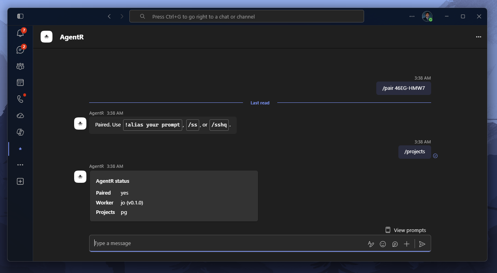
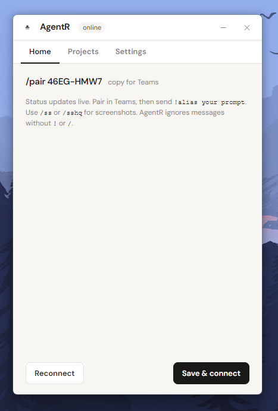
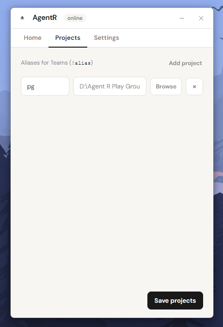
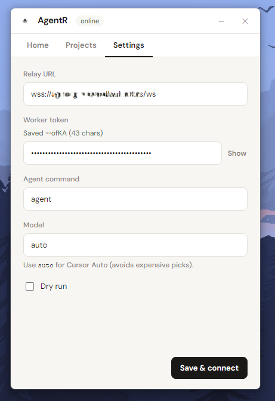

# AgentR

Self-hosted bridge from **Microsoft Teams** to a **local Cursor agent** on your PC.

Type in Teams → a small cloud VM relays over WebSockets → your workstation runs Cursor CLI against local repos → live task cards (and optional desktop screenshots) come back to the same chat.

<p align="center">
  
</p>

## How it works

1. Run the **desktop tray** on your PC (Home / Projects / Settings).
2. Sideload the **AgentR** bot in Teams and `/pair` with the code from the tray.
3. Map folders to short aliases, then prompt with `!alias …`.

| In Teams | What it does |
|----------|----------------|
| `/pair <code>` | Link this chat to your PC |
| `!alias your prompt` | Run Cursor agent in that project |
| `/ss` | Preview screenshots (all monitors) |
| `/sshq` | High-quality screenshots |
| `/help` | Full command list |

AgentR only replies to messages starting with `!` or `/`.

## Desktop app

<p align="center">
  
  &nbsp;
  
</p>

<p align="center">
  
</p>

- **Home** — online status, `/pair` code, reconnect  
- **Projects** — alias → folder (used as `!alias` in Teams)  
- **Settings** — relay URL, worker token, agent command, model (`auto` by default)

## Quick start

```bash
npm install
npm run build
# or on Windows: .\scripts\build.ps1

npm run cli:setup      # on the VM
npm run dev:tray       # on the PC
```

Full guides: **[`docs/`](./docs/README.md)**

| Guide | |
|-------|--|
| [Architecture](./docs/architecture.md) | Packages & data flow |
| [Azure & Teams](./docs/azure-teams.md) | Bot, secret, channel, sideload |
| [VM setup](./docs/vm-setup.md) | Wizard, Caddy, ports |
| [Desktop tray](./docs/desktop-tray.md) | Settings UI & worker token |
| [After adding the bot](./docs/after-teams.md) | Pair → first prompt |
| [Troubleshooting](./docs/troubleshooting.md) | TLS, App ID, offline worker |
| [Protocol](./docs/protocol.md) | WSS messages |
| [Local development](./docs/local-dev.md) | Mock mode |

## License

MIT
